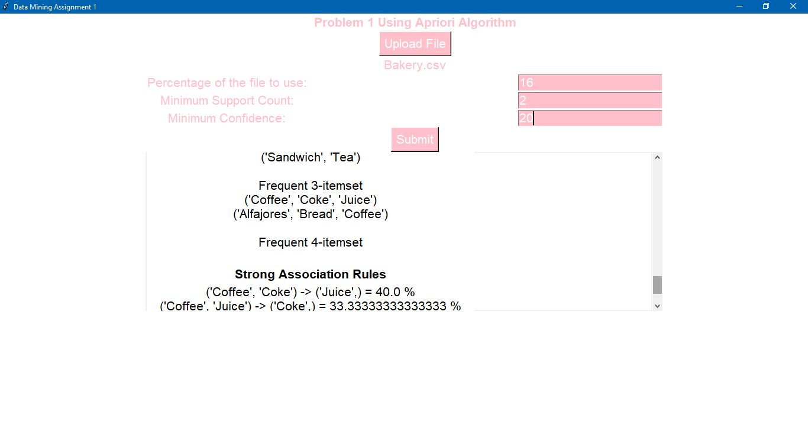

# Apriori-Algorithm-with-Tkinter-GUI
This repository contains a Python implementation of the Apriori algorithm for generating frequent itemsets and association rules, with a user-friendly Tkinter GUI.

